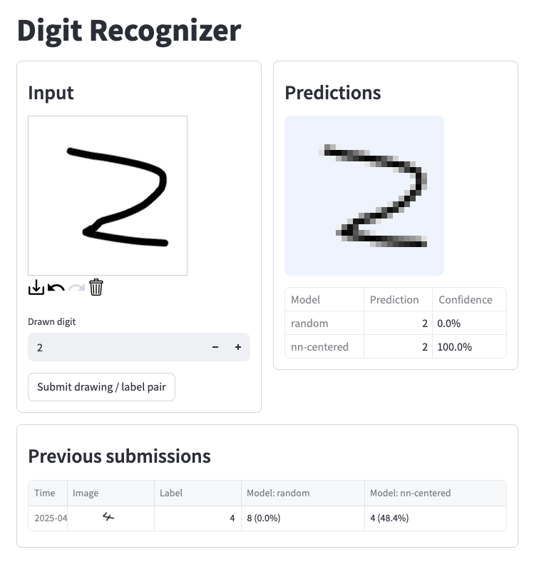

# Digit Recognizer - Machine Learning Institute Project

The site is available at https://digit-recognizer.david-edey.com

## Development

To get started:
* Install the [uv package manager](https://docs.astral.sh/uv/getting-started/installation/)
* Use `./dev-server.sh` to run locally, which spins up:
  * The model api on `:8000`
  * The streamlit front-end on `:6080`
* If you have docker you can also test the docker file with `docker-compose up`

## Deployment

See the scripts in the deployment folder.
